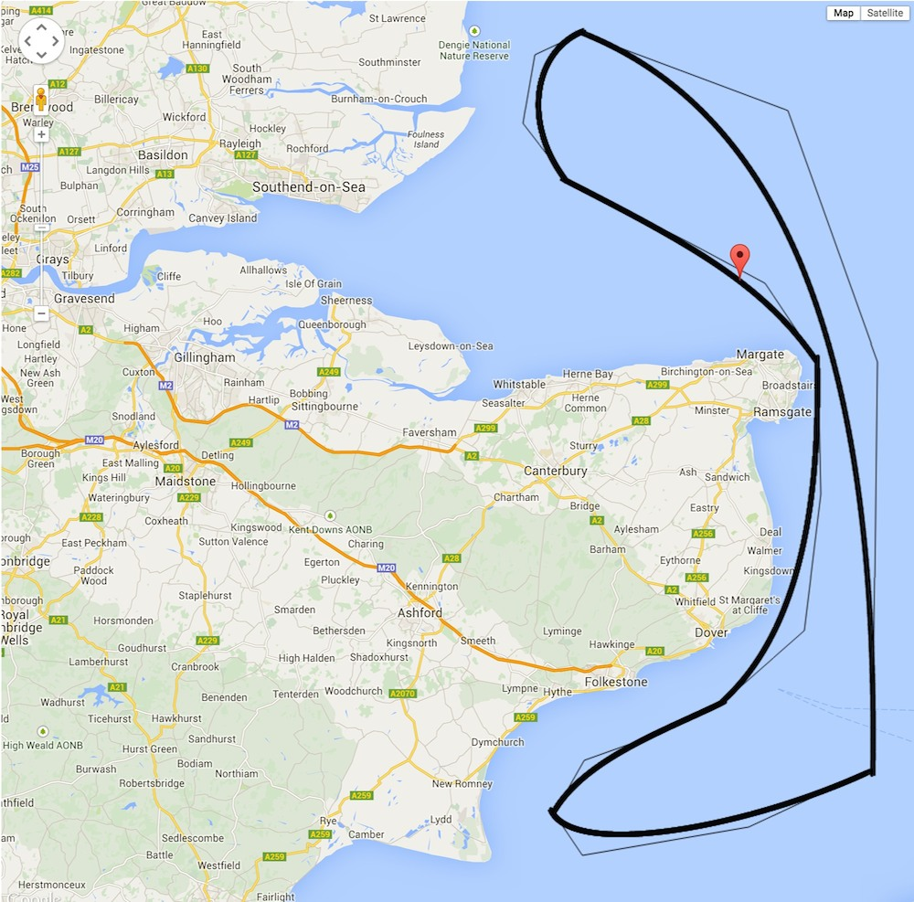

# Pathfinder

Draw a path on google maps and have things follow it

## Aim

Back when I was writing 8 bit video games you'd have the alien sprites following a path.
As the viewport moved over the scrolling background the aliens would move on the screen
relative to where they were on their path and where the viewport was 'looking'.

I wanted to do the same thing but on Google maps.  I also wanted the paths to be made up
of smooth curves like in yairEO's [pathAnimator](https://github.com/yairEO/pathAnimator).

## Spike Prototype

Poking around in the Google Docs I found an [example](https://developers.google.com/maps/documentation/javascript/examples/polyline-complex) that allowed you to plot an arbitrary polyline by clicking at points on the map.

Combining this with [nicoabie](http://stackoverflow.com/users/1461421/nicoabie)'s [code](http://stackoverflow.com/a/14776341/1064619) for drawing a Bézier Curve and [ThinkingStiff](http://stackoverflow.com/users/918414/thinkingstiff)'s [code](http://stackoverflow.com/questions/8024784/how-to-move-marker-in-google-maps-api) for moving a marker on a map I had a quick and dirty [prototype](spike/index.html) for moving something along a Bezier Curve.  I then made it so that once the first curve had been drawn, clicking again on the map would add another curve to the end of that one and so on and so on.

## Refactor to Tests

The next step is to have more than one 'alien' following a path.  This is the point I introduce [tests](test) to guide the design.

